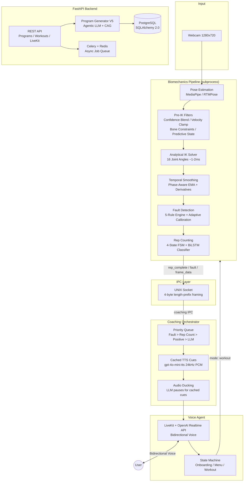

# Nowva AI

**Real-time AI fitness coach — voice interaction, computer vision, and biomechanics analysis at 30 FPS**


---

## Overview

Nowva AI is a real-time fitness coaching platform that watches you exercise through a webcam, reconstructs your 3D skeleton, computes joint kinematics, detects form faults, and coaches you with voice — all in real time. The system combines a conversational voice agent (LiveKit Agents SDK + OpenAI Realtime API), a custom biomechanics pipeline processing 30 FPS video, and an agentic LLM pipeline for personalized workout programming.

- **6-layer biomechanics pipeline** with a custom analytical IK solver computing 16 joint angles at ~1-2ms per frame
- **Priority-based coaching orchestrator** delivering cached fault cues with audio ducking over LLM-generated speech
- **Agentic program generation** reduced from 10 minutes to ~1 second using Cache Augmented Generation

---

## Architecture



### Data Flow

1. **Camera** captures frames at 30 FPS
2. **Pose estimation** extracts 17 COCO keypoints with 3D world coordinates
3. **Pre-IK filters** enforce anatomical constraints (bone lengths, velocity limits)
4. **Analytical IK** computes 16 joint angles from vector geometry
5. **Temporal smoothing** applies phase-aware filtering (different cutoffs for descent vs. ascent)
6. **Fault detection** evaluates 5 rules with body-proportion-scaled thresholds
7. **Rep counting** runs dual FSM + BiLSTM systems in parallel
8. Results flow over **UNIX domain sockets** (length-prefix framed JSON) to the coaching orchestrator
9. **Priority queue** dispatches cached audio cues (deterministic) and LLM speech (adaptive) with ducking
10. **Voice agent** delivers real-time coaching through LiveKit

---

## Key Technical Highlights

### Biomechanics Pipeline

Six processing layers orchestrated by a single `process_frame()` call that returns a `PipelineFrame` containing the 2D/3D skeleton, joint angles, detected faults, rep data, BiLSTM predictions, and per-layer latency measurements. The pipeline manages a two-gate system: a **standing gate** (validates upright posture across 5 consecutive frames before calibration) and a **readiness gate** (requires 30 consecutive valid frames per set before rep counting begins).

### Analytical Inverse Kinematics

Custom geometric solver that computes **16 joint angles** from 3D skeleton landmarks using vector dot products and plane projections — no dependency on OpenSim or external musculoskeletal models. Outputs hip flexion/adduction/rotation (per side), knee flexion, ankle dorsiflexion, trunk flexion/lateral flexion/rotation, and pelvis tilt/list/rotation. Pelvis tilt is estimated via a parameterized coupling factor (0.30-0.55) derived from the user's hip-to-torso ratio. Runs at **~1-2ms per frame on CPU**.

### Dual Rep Counting: FSM + BiLSTM

Two parallel rep counting systems:
- **Rule-based FSM** with 4 states (IDLE, DESCENDING, BOTTOM, ASCENDING) using knee flexion thresholds and velocity sign detection with minimum dwell times
- **BiLSTM depth classifier** — 2-layer bidirectional LSTM (hidden=128) over a 14-dimensional feature vector (4 joint angles + 6 normalized bone lengths + 4 vertical displacements) on a 30-frame sliding window, outputting 5-class depth probabilities (standing / quarter / half / parallel / deep) with vector EMA smoothing (alpha=0.2)

When BiLSTM is enabled, its rep events are enriched with rule-based metrics (angle data, timing, faults, bilateral asymmetry) for downstream coaching consumers.

### Adaptive Fault Detection

Five-rule engine with **two-phase calibration** that personalizes thresholds to each user:

1. **Body proportion scaling** — Bone constraints calibrate over the first 30 standing frames, deriving `BodyProportions` (hip width, femur length, tibia length, torso length). These scale fault thresholds: knee valgus by hip-to-femur ratio, heel rise by tibia length, forward lean by femur-to-torso ratio.
2. **Baseline calibration** — After the first clean rep, peak trunk flexion, peak asymmetry, and peak dorsiflexion drop are recorded. Thresholds shift +10-20 degrees above observed peaks to prevent false positives on the user's natural movement pattern.

Fault rules: **depth classification** (quarter/half/parallel/below-parallel), **bilateral asymmetry** (L-R angle difference at 3 severity levels), **heel rise**, **forward lean**, and **knee valgus**. Same-fault deduplication enforces a 15-frame (0.5s) minimum gap.

### Pre-IK Skeleton Filtering

Optional 4-stage filtering pipeline that cleans noisy pose estimates before inverse kinematics:

| Stage | Method | Purpose |
|-------|--------|---------|
| Confidence Blending | Weighted interpolation (0.1-0.9 range) | Suppress low-confidence keypoints |
| Velocity Clamping | 2.5 m/s physical limit | Prevent teleporting joints |
| Bone Length Constraints | 12 pairs calibrated over 30 frames, +/-15% tolerance | Enforce anatomical consistency |
| Predictive State | 0.2s lookahead extrapolation | Pre-cue faults before they fully manifest |

### Coaching Orchestrator

Priority-based async dispatch system that mixes cached audio cues with LLM-generated speech:

| Priority | Type | Latency | Example |
|----------|------|---------|---------|
| 1 | Fault Cue (cached TTS) | < 50ms | "Knees out!", "Chest up!" |
| 2 | Rep Count (cached TTS) | < 50ms | "One!", "Two!", "Three!" |
| 3 | Positive Cue (cached TTS) | < 50ms | "Good rep!", "Strong!" |
| 10 | LLM Motivation | ~500ms | Context-aware encouragement |
| 20 | LLM Set Recap | ~1-2s | Fault analysis + coaching tips |

Cached cues are pre-generated via `gpt-4o-mini-tts` (24kHz PCM, 30-minute TTL) before each set. **Audio ducking** pauses LLM speech when cached cues play. Fault rate limiting enforces an 8-second minimum between same-type cues. Stale events are dropped (>500ms for cached, >1s for motivation).

### IPC Architecture

Multi-process communication over **UNIX domain sockets** with 4-byte big-endian length-prefix framing and JSON payloads. Two channels: **main IPC** (`/tmp/nowva_ipc.sock`) carries pose pipeline data to the main process, **coaching IPC** (`/tmp/nowva_coaching.sock`) forwards events to the voice agent. Handles partial reads, connection retry with timeout, and a 1MB message safety limit.

### Voice Agent

Built on **LiveKit Agents SDK** with the **OpenAI Realtime API** for fully integrated STT + LLM + TTS bidirectional voice. The agent operates as a mode-aware state machine (onboarding, main menu, workout) with persistent state serialized to disk. During workouts, the agent coordinates with the coaching orchestrator via context swapping — isolating coaching LLM calls from the main conversation context to prevent prompt pollution, with a lock to avoid overlapping with wake-word responses.

---

## Tech Stack

| Domain | Technologies |
|--------|-------------|
| **Core** | Python 3.11+, FastAPI, Pydantic, YAML config |
| **Voice** | LiveKit Agents SDK, OpenAI Realtime API (STT + LLM + TTS) |
| **CV / ML** | PyTorch (BiLSTM), OpenCV, MediaPipe, ONNX Runtime (RTMPose) |
| **Data** | PostgreSQL, SQLAlchemy 2.0, Redis, Celery |
| **Numerical** | NumPy, SciPy, Pandas |
| **Visualization** | Matplotlib, Seaborn, OpenCV overlays |
| **Frontend** | React, TypeScript |
| **Deployment** | Gunicorn, Uvicorn, Docker, GCP Cloud Run |

---

## Project Structure

```
src/
├── main.py                    # Application orchestrator — subprocess lifecycle, IPC wiring, state monitoring
├── agents/                    # Voice agent (LiveKit + OpenAI Realtime API)
│   ├── voice_agent.py         # Mode-aware agent with function tools and context management
│   ├── prompts/               # System prompts per mode (onboarding, menu, workout, program creation)
│   ├── mixins/                # Modular agent behaviors
│   └── shared/                # Shared utilities
├── biomechanics/              # 6-layer real-time processing pipeline
│   ├── pipeline.py            # Pipeline orchestrator — process_frame() with per-layer latency
│   ├── config.py              # Pydantic config system (17 sub-configs loaded from YAML)
│   ├── kinematics/            # Analytical IK solver — 16 joint angles from vector geometry
│   ├── faults/                # Rule engine (5 rules), rep counter (FSM), fault types
│   ├── ml/                    # BiLSTM model, inference pipeline, feature extractor, sequence buffer
│   ├── pose/                  # MediaPipe + RTMPose backends
│   ├── coaching/              # Session tracker, IPC bridge, cue cache
│   ├── utils/                 # Filters, gates, geometry, types, derivatives
│   └── viz/                   # 2D skeleton overlay, post-session plots
├── services/                  # Coaching orchestrator, audio cue service, set reports
├── core/                      # IPC communication, agent state, workout session, session management
├── api/                       # FastAPI backend
│   ├── routers/               # Endpoints: programs, workouts, livekit, health
│   ├── services/              # Program saving, updating, job management
│   └── models/                # Pydantic request/response schemas
├── db/                        # SQLAlchemy 2.0 models, migrations, utilities
├── program_generator_v5/      # 6-layer workout program generation with agentic LLM + CAG
├── pose/                      # Pose estimation subprocess entry point
└── auth/                      # User management
```

---

## Getting Started

### Prerequisites

- Python 3.11+
- PostgreSQL 15+
- Redis (for Celery task queue)
- Webcam

### Installation

```bash
git clone https://github.com/yourusername/NowvaLiveKit.git && cd NowvaLiveKit
python -m venv venv && source venv/bin/activate
pip install -r requirements.txt
```

### Configuration

```bash
cp .env.example .env
```

Required environment variables:

| Variable | Purpose |
|----------|---------|
| `OPENAI_API_KEY` | OpenAI Realtime API + TTS cue generation |
| `LIVEKIT_URL` | LiveKit server URL |
| `LIVEKIT_API_KEY` | LiveKit API key |
| `LIVEKIT_API_SECRET` | LiveKit API secret |
| `DATABASE_URL` | PostgreSQL connection string |

### Running

```bash
# Full system: voice agent + biomechanics pipeline + API
python src/main.py

# API backend only
uvicorn src.api.main:app --port 8000

# Biomechanics pipeline config
# Edit config/biomechanics.yaml to adjust FPS, pose backend, fault thresholds, BiLSTM settings
```

---

## Testing

18 test files covering all pipeline components:

```bash
pytest tests/
```

| Area | Coverage |
|------|----------|
| **Pipeline** | End-to-end frame processing |
| **Kinematics** | IK solver angle accuracy |
| **Faults** | All 5 fault rules + deduplication |
| **Rep Counting** | FSM state transitions + BiLSTM inference |
| **Temporal Filtering** | Confidence blend, velocity clamp, bone constraints, predictive state, phase-aware smoothing |
| **Gates** | Standing gate validation, readiness gate |
| **Body Proportions** | Proportion derivation + threshold scaling |
| **Coaching** | Orchestrator priority dispatch, audio cue service |
| **Visualization** | Set plot generation |

---

## Database Schema

PostgreSQL with SQLAlchemy 2.0 ORM. Core models:

**User** / **UserGeneratedProgram** / **PartnerProgram** — user profiles and AI-generated or pre-built workout programs

**Workout** / **WorkoutExercise** / **Set** — hierarchical workout structure with exercise ordering, target reps/weight/RPE, and velocity-based training (VBT) thresholds

**ProgressLog** — per-set completion tracking including measured velocity and velocity loss for VBT protocols

**Schedule** / **ScheduleChangeHistory** — workout scheduling with skip/deload tracking and full undo history

**TrainingLoadMetrics** / **DeloadHistory** — weekly volume/intensity/velocity aggregates and deload recommendation tracking

**ProgramGenerationJob** — Celery async job tracking for program generation requests
