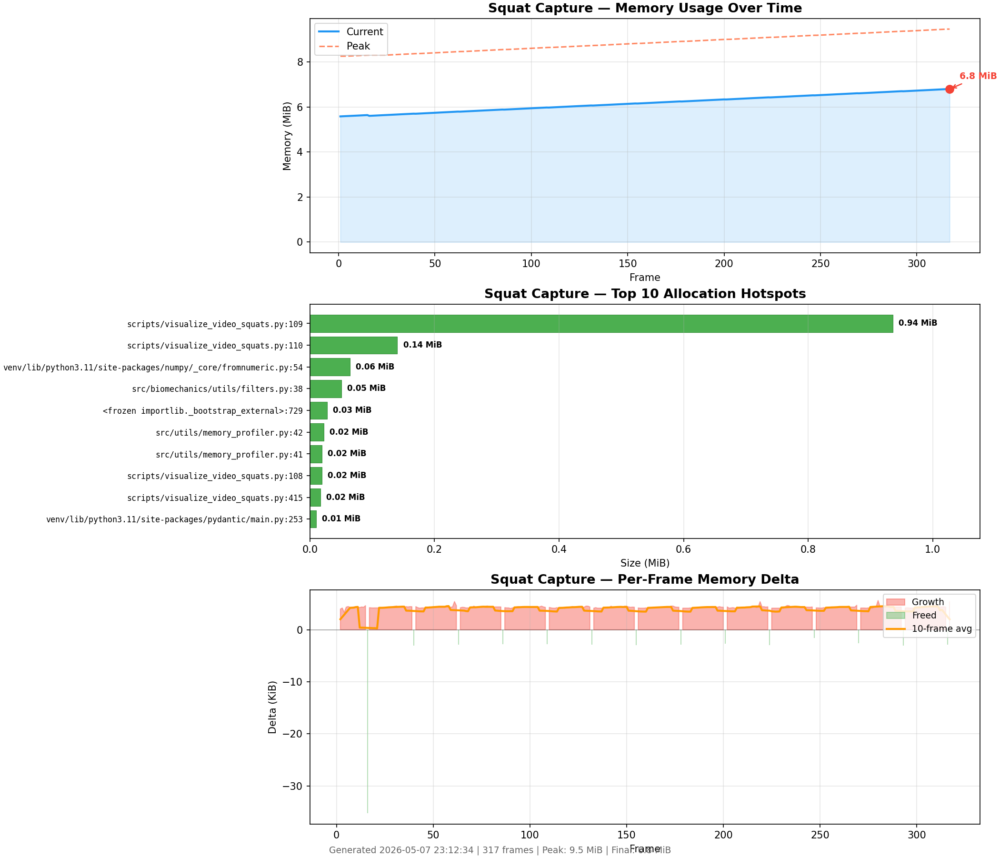

# Memory Profiling — Biomechanics Pipeline

## Overview

The biomechanics pipeline processes video frames in real-time through pose estimation, inverse kinematics, and rep counting. Each frame passes through ~10 processing stages, making memory behavior critical for long sessions on embedded hardware.

A reusable `tracemalloc`-based profiler (`src/utils/memory_profiler.py`) instruments the pipeline and produces visual reports. Toggle it via `ENABLE_TRACEMALLOC=true` in `.env`.

## Baseline Profile — 5-Rep Squat Capture

**Test date:** 2026-05-07
**Test conditions:** 317 frames, 30fps, single webcam, MediaPipe pose estimation, full pre-IK filter chain enabled.



### Memory Usage Over Time

| Metric | Value |
|--------|-------|
| Start memory | ~5.0 MiB |
| End memory | ~6.8 MiB |
| Peak memory | 6.8 MiB |
| Total growth | ~1.8 MiB over 317 frames |
| Growth rate | **~3 KiB/frame** |

Memory rises linearly with frame count. The current and peak lines track closely — no transient spikes. The pipeline is not leaking; the growth is entirely from `frames_data` accumulating frame dictionaries for the HTML replay.

### Allocation Hotspots

| Rank | Location | Size |
|------|----------|------|
| 1 | `visualize_video_squats.py:189` (frame data construction) | 0.94 MiB |
| 2 | `visualize_video_squats.py:189` (secondary dict allocation) | 0.14 MiB |
| 3 | `numpy/core/fromemeric.py:34` | 0.06 MiB |
| 4 | `biomechanics/utils/filters.py:38` | 0.05 MiB |
| 5 | `memory_profiler.py:42` (profiler overhead) | 0.02 MiB |

The frame data list dominates. Pose estimation, IK solving, and all pre-IK filters (confidence blend, velocity clamp, bone constraints, position smoother) reuse their buffers correctly — they do not appear as growing allocations.

### Per-Frame Delta

Deltas are flat near zero after frame ~25. A single negative spike at frame ~25 corresponds to the calibration-to-recording state transition where calibration buffers are freed. No anomalous growth patterns.

## Scaling Projections

| Session length | Frames (30fps) | `frames_data` memory |
|----------------|-----------------|----------------------|
| 5 reps (~20s) | 317 | ~1.8 MiB |
| 1 set (60s) | 1,800 | ~5.3 MiB |
| 1 set (90s) | 2,700 | ~7.9 MiB |
| Full workout (1hr, no flush) | 108,000 | **~324 MiB** |

Without intervention, a 1-hour continuous capture would accumulate ~324 MiB in `frames_data` alone, plus a massive HTML output that would choke the browser.

## Strategy — Per-Set Memory Lifecycle

For production hardware running full workouts, the pipeline should follow a per-set memory lifecycle:

1. **Set starts** — `frames_data` accumulates in memory (~3 KiB/frame)
2. **Set ends** — process rep boundaries, generate visual feedback (or skip if the set was clean), save results to disk
3. **Clear from memory** — `frames_data.clear()`, reset rep counter and filter state
4. **Next set** — start fresh at near-zero footprint

This bounds peak memory to the longest single set (~5-8 MiB for a 60-90s set) regardless of total workout duration. A 1-hour workout with 20 sets uses the same peak memory as a single set.

The tracemalloc profiler can validate this by running per-set and confirming memory returns to baseline after each clear. If it doesn't, that indicates a real leak in the filter chain or pose estimator.

## How to Use the Profiler

```bash
# Enable in .env
ENABLE_TRACEMALLOC=true

# Run any instrumented script
python scripts/visualize_video_squats.py

# Output appears alongside the video:
# recordings/squat_YYYYMMDD_HHMMSS_memory_profile.png
```

To instrument other files:

```python
from utils.memory_profiler import MemoryProfiler

profiler = MemoryProfiler()  # reads ENABLE_TRACEMALLOC from env
profiler.start()

for i, frame in enumerate(frames):
    process(frame)
    profiler.snapshot(i)

profiler.stop()
profiler.generate_report(Path("output/memory.png"), title_prefix="My Script")
```

When `ENABLE_TRACEMALLOC=false` (default), all methods are no-ops with zero overhead.
